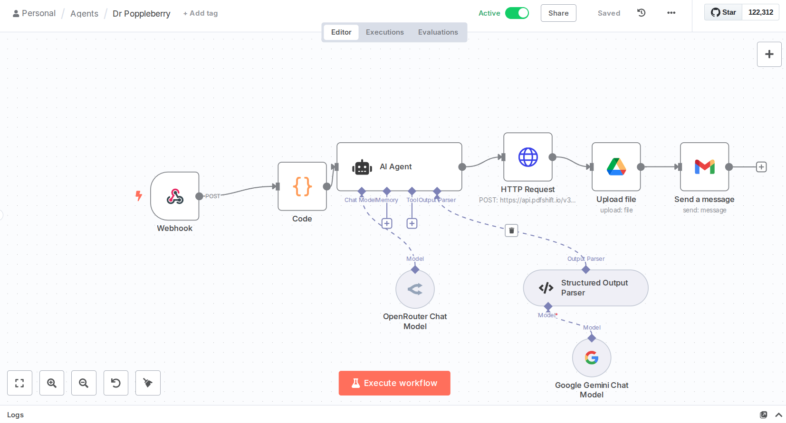

# Dr. Dovid Berry AI Parenting Agent Workflow



An n8n workflow that creates an AI-powered parenting advice system using multiple language models, PDF generation, and automated email delivery.

## Overview

Dr. Dovid Berry is an AI parenting research assistant that provides thoroughly researched, evidence-based parenting advice. The system accepts questions through a web form, processes them through AI models, generates PDF reports, and delivers personalized responses via email.

## Workflow Architecture

The workflow consists of 8 interconnected nodes:

1. **Webhook** - Receives form submissions from Tally.so
2. **Code Node** - Processes form data and extracts recipient information
3. **AI Agent** - Generates structured parenting advice using language models
4. **OpenRouter Chat Model** - Primary AI model (Claude Sonnet 4)
5. **Google Gemini Chat Model** - Alternative AI model
6. **Structured Output Parser** - Ensures consistent JSON response format
7. **HTTP Request (PDFShift)** - Converts HTML responses to PDF
8. **Google Drive Upload** - Saves PDFs to cloud storage
9. **Gmail Send** - Delivers formatted email responses

## Key Features

### AI-Powered Responses
- Uses **Claude Sonnet 4** via OpenRouter as the primary model
- **Google Gemini 2.0 Flash** as backup/alternative
- Structured output ensures consistent formatting
- Contextual advice for parents in Jerusalem, Israel

### PDF Generation
- **PDFShift API** converts HTML to professional PDFs
- Automatic file naming based on question summaries
- Print-optimized formatting

### Automated Delivery
- Email templates with professional styling
- Google Drive integration for file storage
- Multiple recipient support
- Branded email design with Dr. Dovid Berry persona

### Form Integration
- **Tally.so** form for question submission
- Dynamic recipient selection
- Question preprocessing and validation

## Technical Implementation

### Language Models
- **Primary**: `anthropic/claude-sonnet-4` (via OpenRouter)
- **Secondary**: `models/gemini-2.0-flash` (via Google AI)
- Structured JSON output with predefined schema

### PDF Processing
- **Service**: PDFShift API
- **Format**: A4, portrait orientation
- **Features**: Print optimization, CSS styling

### Cloud Storage
- **Platform**: Google Drive
- **Organization**: Automatic folder structure
- **Access**: Shareable links in email responses

### Email System
- **Provider**: Gmail API
- **Template**: Custom HTML with inline CSS
- **Features**: Responsive design, branded styling

## Response Structure

The AI generates responses in this JSON format:

```json
{
  "summary_file_safe": "question-topic-in-lowercase-with-hyphens",
  "summary_human_readable": "Question Topic In Title Case",
  "summarised_prompt": "Brief summary of the user's question",
  "html_response": "<p>Email-ready HTML content</p>",
  "html_full_document": "<!DOCTYPE html>...Complete HTML document..."
}
```

## Setup Requirements

### API Keys and Credentials
- **OpenRouter API** - For Claude Sonnet 4 access
- **Google AI API** - For Gemini model access
- **PDFShift API** - For PDF generation
- **Google Drive OAuth** - For file storage
- **Gmail OAuth** - For email sending

### Form Configuration
- Tally.so form with specific field structure:
  - "Your question for Dr Dovid Berry" (text field)
  - "Send answer to" (multiple choice for recipients)

### Webhook Setup
- n8n webhook endpoint configured to receive Tally.so submissions
- POST method with JSON payload processing

## File Structure

```
├── config.json                 # n8n workflow configuration
├── email-template.html         # Email template for responses
├── images/
│   └── 1.png                   # Workflow diagram
└── README.md                   # This documentation
```

## Email Template

The email template (`email-template.html`) features:
- Professional medical-style design
- Responsive layout with inline CSS
- Dr. Dovid Berry branding
- Direct links to Google Drive files
- Call-to-action for additional questions

## Workflow Logic

1. **Form Submission** → Webhook receives Tally.so data
2. **Data Processing** → Code node extracts question and recipients
3. **AI Processing** → Agent generates structured response using Claude/Gemini
4. **PDF Creation** → HTML converted to PDF via PDFShift
5. **File Storage** → PDF uploaded to Google Drive
6. **Email Delivery** → Formatted email sent with PDF link

## Customization Options

### AI Persona
Modify the system message in the AI Agent node to adjust:
- Response tone and style
- Expertise focus areas
- Output format requirements
- Regional context

### Email Design
Customize `email-template.html` for:
- Branding and colors
- Layout and typography
- Additional content sections
- Call-to-action buttons

### PDF Formatting
Adjust PDFShift parameters for:
- Page size and orientation
- Print optimization
- Margin settings
- CSS styling

## Usage

1. Deploy the n8n workflow using `config.json`
2. Configure all required credentials and API keys
3. Set up the Tally.so form with proper field mapping
4. Test the webhook endpoint
5. Customize email template and AI prompts as needed

## Dependencies

- **n8n** - Workflow automation platform
- **OpenRouter** - AI model access
- **Google Cloud APIs** - Drive and Gmail integration
- **PDFShift** - PDF generation service
- **Tally.so** - Form builder platform

